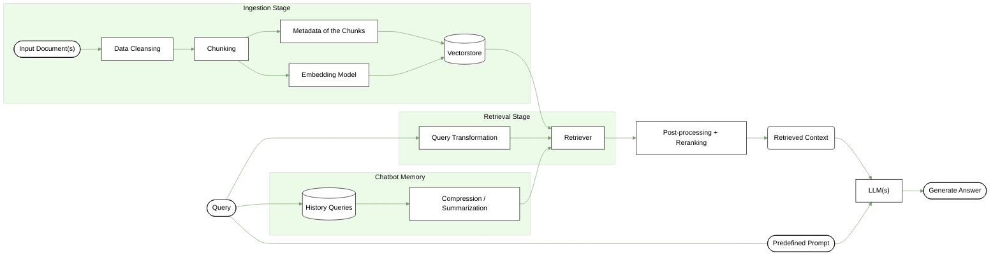

# In Context Chatbot
Retrieval Augmented Generation (RAG) is used. Proposed algorithm are shown in the flowchart.


## Usage

### Run Locally 

To install the necessary dependencies, run the following command:
```shell
pip install -r requirements/requirements-document-chatbot.txt
```

### Models

Currently supported models:
- Azure OpenAI
  - Set up .env file with API information,
      ```
        AZURE_OPENAI_ENDPOINT=...
        OPENAI_API_TYPE=...
        OPENAI_API_KEY=...
        OPENAI_API_VERSION=...
        AZURE_OPENAI_DEPLOYMENT_NAME=...
    ```
- LLama2 13B
  - Only support local run now, you will need to download the local model (`llama-2-13b-chat.Q5_K_M.gguf`) from [Hugging Face](https://huggingface.co/TheBloke/Llama-2-13B-chat-GGUF).
  - Once downloaded, place the models in the `models/` directory in the project root.
- Mistral 7B
  - [Ollama](https://ollama.ai/) is used to run the model locally, install according the instruction [here](https://github.com/jmorganca/ollama).
  - After installation, run `ollama pull mistral` to save the model locally.

### Chatbot Interface
To run the application locally, execute the following command:
```shell
streamlit run app.py
```
A local Streamlit server will spin up and the app will open in a new tab in the default web browser.

